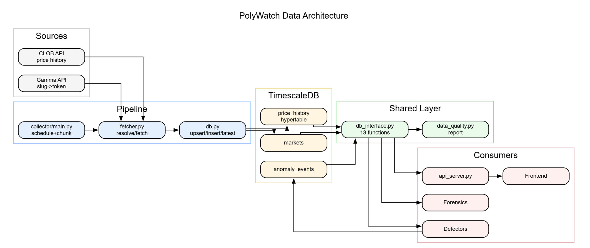
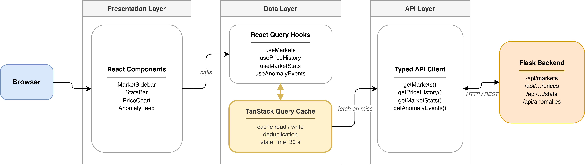
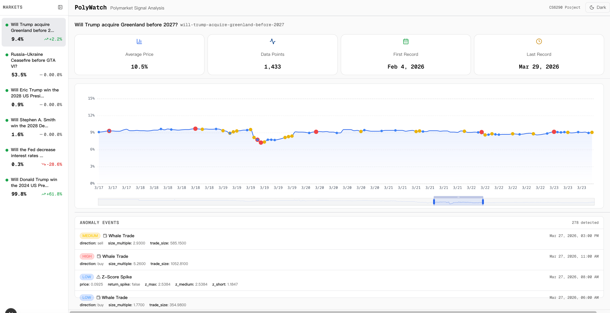
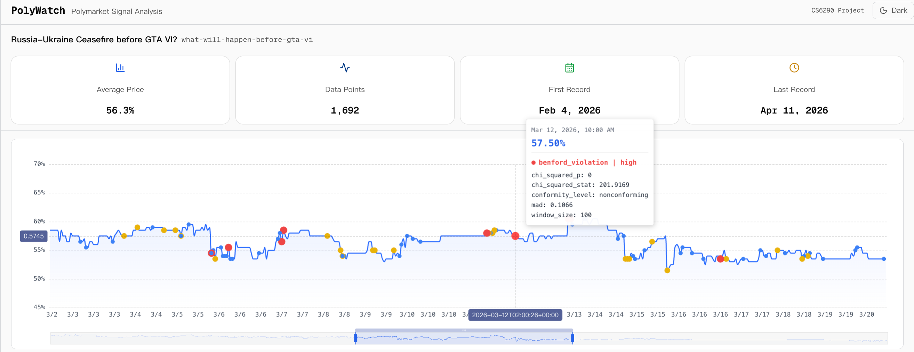
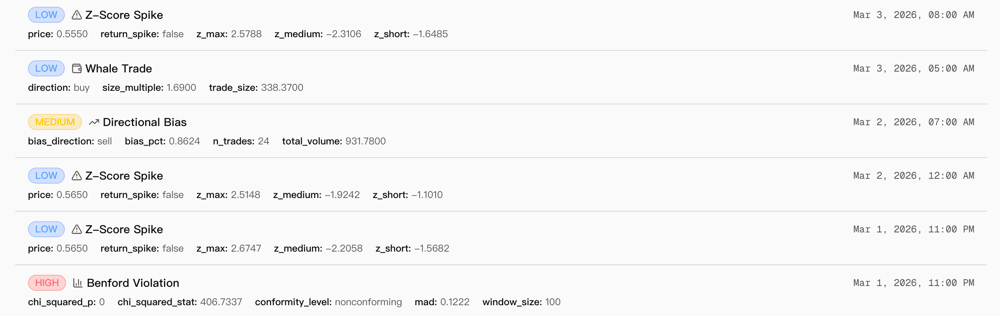
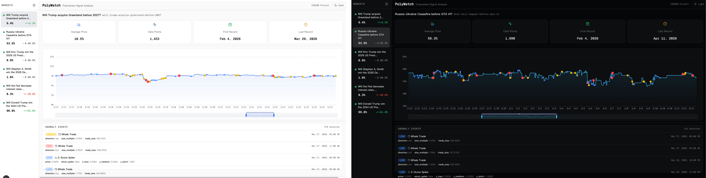

# PolyWatch —— Real-time Anomaly Detection for Prediction Markets

<div style="text-align: center;">Project Repository: https://github.com/wwp-max/PolyWatch</div>

## 1. Architecture and Specification Governance

### 1.1 System Overview

PolyWatch is structured as an end to end anomaly detection system for prediction markets. The pipeline integrates data ingestion, statistical detection, event persistence, forensic review, and dashboard consumption. The technical objective of this section is to present a coherent architecture and a verifiable specification framework aligned with implemented modules.

### 1.2 Architecture and Data Flow

The system is organized into three operational flows.

- Data flow from market APIs through scheduled collection into TimescaleDB tables
- Detection flow where statistical detectors emit typed anomaly events
- Consumption flow where API services, forensic analysis, and visualization modules read the anomaly stream

Figure 1 presents the maintained architecture diagram used in implementation and reporting.



Primary architecture artifacts:

- `docs/architecture-threat-model.md`
- `docs/architecture-diagram.mmd`
- `docs/evidence/assets/system-architecture.svg`

### 1.3 Threat Model and Event Semantics

The threat catalog is formalized as operational risk classes and mapped to concrete event outputs. This mapping ensures that report level security claims are anchored to executable modules and persisted event records.

Implemented event mappings:

- `zscore_spike` -> `core_analysis/zscore_detector.py`
- `whale_trade` -> `core_analysis/whale_alert.py`
- `whale_directional_bias` -> `core_analysis/whale_alert.py`
- `benford_violation` -> `core_analysis/benford_detector.py`

Event writing is handled by `core_analysis/db_interface.py` into `anomaly_events`, which provides a stable boundary between detection semantics and downstream analysis.

### 1.4 Specification Driven Verifiability

Detection requirements are maintained as executable style specifications. These files define behavioral expectations, threshold decisions, and boundary cases in a format suitable for technical audit and validation design.

Specification artifacts:

- `docs/specs/wash_trading.feature`
- `docs/specs/benford_law.feature`

This specification layer supports a closed verification chain from requirements to detector behavior, typed event output, and test evidence.


## 2. Data Infrastructure and Engineering

### 2.1 Overview
The data infrastructure serves as the foundational backbone of the PolyWatch platform. Designed to meet the team's requirements for a real-time market integrity monitor, this subsystem is responsible for automated data ingestion, structured time-series storage, and providing a unified Data Access Layer (DAL) for all downstream analytical modules. 

To ensure the team's algorithms could be tested consistently (supporting the project's empirical analysis requirements), a stable seed dataset (`price_history_seed.csv`) containing 10,564 historical rows across 6 markets was extracted and committed to the repository. This decoupled the core logic development from live data dependencies.


*(Figure 2.1: PolyWatch Data Architecture and Pipeline Flow)*

### 2.2 ETL Pipeline Implementation
The Extract, Transform, Load (ETL) pipeline is fully containerized using Docker Compose (`timescaledb` and `collector` services) to ensure environment consistency across the team.
*   **Data Sources & Edge Case Handling**: The pipeline integrates with two official Polymarket APIs. The **Gamma API** is used to resolve human-readable market slugs into unique `token_id`s. A notable engineering challenge handled here was parsing `clobTokenIds`, which the API unpredictably returns as stringified JSON arrays. The **CLOB API** is utilized to fetch historical and real-time price data at a 60-second fidelity.
*   **Collection Strategy & Rate Limiting**: The collector operates on a scheduled polling mechanism (300-second intervals). To circumvent the CLOB API's strict time-range limitations (which reject queries spanning more than 7 days with HTTP 400 errors), the fetcher implements a robust **chunked pagination strategy** (6-day chunks).
*   **Incremental Updates**: For active markets, the pipeline queries the database for the latest recorded timestamp and only fetches new delta data, optimizing network bandwidth and API quota usage.

### 2.3 Database Schema and Integrity
Given the high-frequency nature of financial data, **TimescaleDB** (a PostgreSQL extension for time-series data) was selected. The schema was engineered to guarantee data integrity at the physical storage layer:
*   **Hypertable Optimization**: The `price_history` table is configured as a TimescaleDB hypertable partitioned by `time`. This significantly accelerates the time-series aggregations required by Member C's anomaly detection algorithms.
*   **Ensuring Idempotency**: To guarantee data consistency across system restarts, network retries, or duplicate fetch cycles, a composite constraint `UNIQUE(time, token_id)` is enforced. The pipeline uses `ON CONFLICT DO NOTHING` during bulk inserts, providing strictly idempotent database operations.
*   **Schema Layout**: The database maintains three core tables: `markets` (metadata), `price_history` (time-series data), and `anomaly_events` (a write-back table for algorithms to store detected manipulation events).

### 2.4 Shared Data Interface and Quality Assurance
To decouple the database operations from the team's analytical logic, a unified interface (`core_analysis/db_interface.py`) was developed.
*   **Unified Access Layer (DAL)**: Exposing 13 standardized functions (e.g., `get_price_series`, `write_anomaly`, `get_markets_df`), this layer allows the Algorithms (Member C) and Frontend (Member E) modules to interact with the data models using native Python types (DataFrames) without writing raw SQL, ensuring clean architectural boundaries.
*   **Data Quality Validation**: A dedicated data quality module (`data_quality.py`) continuously assesses the health of the collected data. It evaluates:
    *   **Completeness**: Percentage of expected data points.
    *   **Gaps**: Identification of missing time segments.
    *   **Freshness**: Time since the last data point.
    *   Markets are automatically classified into tiers: **Healthy** (complete and up-to-date), **Degraded** (minor data gaps/delays), **Critical** (severe gaps/out-of-bounds prices), or **Closed** (resolved markets).

### 2.5 Reliability and Testing
To ensure the data pipeline is resilient in a production-like monitoring environment, a comprehensive suite of 25 automated tests (via `pytest`) was implemented:
*   **Unit Tests (Mocked DB)**: Validates boundary conditions and the data quality grading logic without requiring a live database.
*   **End-to-End Integration Tests**: Uses a live TimescaleDB instance to verify database insertion, the `UNIQUE` constraint (idempotency), and the end-to-end correctness of the shared interface functions.


## 3. Core Anomaly Detection Algorithms

### 3.1 Overview
The anomaly detection engine constitutes the analytical core of the PolyWatch platform. Positioned between Member B's data infrastructure and Member E's frontend visualization, this subsystem is responsible for ingesting time-series price data, applying multiple statistical detection strategies, and producing structured anomaly events that are persisted back to the database and served via a REST API.

Three independent detection algorithms were designed to attack the problem of market manipulation from orthogonal mathematical dimensions: (1) a multi-window rolling Z-Score detector for sudden price deviations, (2) a Benford's Law conformity analyzer for detecting fabricated numerical patterns, and (3) a Whale Alert system for identifying suspicious large-trade behavior. A backtesting framework validates these algorithms against the 2024 U.S. Presidential Election historical dataset (7,356 price points), providing quantitative Precision/Recall/F1 metrics rather than anecdotal evidence.

The complete engine comprises 2,501 lines of algorithm code across 6 modules, supported by 856 lines of test code (83 unit tests, all passing).

### 3.2 Algorithm 1: Multi-Window Rolling Z-Score Detector
The Z-Score detector (`core_analysis/zscore_detector.py`, 313 lines) is the primary detection mechanism, operating directly on the price time-series provided by Member B's `get_price_series()` function.

*   **Multi-Scale Detection Strategy**: Rather than relying on a single rolling window (which would force a tradeoff between sensitivity and stability), the detector simultaneously computes rolling Z-Scores at three time horizons: **6-hour** (captures flash crashes and sudden spikes), **24-hour** (captures intraday manipulation patterns), and **72-hour** (captures sustained trend anomalies). The maximum absolute Z-Score across all windows (`z_max`) determines whether an alert is triggered, ensuring that anomalies visible at any temporal scale are captured.
*   **EWMA Complementary Signal**: In addition to simple rolling statistics, an Exponentially Weighted Moving Average (EWMA) with a 24-point span provides a decay-weighted baseline that is more responsive to recent price behavior. This is particularly effective for detecting manipulation that gradually escalates rather than appearing as a single spike.
*   **Price Return Rate Spikes**: A third strategy flags any single-step absolute price change exceeding a configurable threshold (default: 5%). This catches instantaneous jumps that may not yet register as statistically significant in the rolling windows due to insufficient lookback data.
*   **Severity Classification and Anomaly Clustering**: Detected anomalies are classified as `medium` (Z >= 2.5) or `high` (Z >= 4.0) severity. To prevent a single manipulation event from generating dozens of fragmented alerts, adjacent anomaly points within a configurable gap (default: 3 data points) are automatically merged into coherent event clusters, each annotated with peak Z-Score, duration, and triggering strategy.

### 3.3 Algorithm 2: Benford's Law Conformity Detector
The Benford detector (`core_analysis/benford_detector.py`, 431 lines) applies a fundamentally different approach: instead of analyzing price magnitude, it examines the statistical distribution of leading digits in numerical data.

*   **Theoretical Basis**: Benford's Law states that in naturally occurring datasets, the leading digit *d* (1–9) appears with probability P(d) = log₁₀(1 + 1/d). Digit 1 appears ~30.1% of the time, while digit 9 appears only ~4.6%. Fabricated or artificially generated trading data tends to deviate from this distribution, as human-generated or bot-generated numbers often exhibit uniform or biased digit patterns.
*   **Triple Statistical Test with Majority Voting**: To avoid over-reliance on any single test statistic, three complementary tests are applied: (1) **Chi-squared goodness-of-fit** (tests observed vs. expected digit frequencies), (2) **Kolmogorov-Smirnov test** (compares cumulative distribution functions), and (3) **Mean Absolute Deviation (MAD)** conformity assessment using Nigrini (2012) thresholds (close < 0.006, acceptable < 0.012, marginal < 0.015). A majority vote across all three tests determines the final conformity verdict.
*   **Sliding Window Temporal Analysis**: Beyond whole-period analysis, the detector slices the time series into overlapping windows (default: 100 points, step 50) and evaluates each window independently. This enables precise temporal localization of anomalous periods rather than only producing a binary whole-dataset verdict.
*   **Data Adaptation**: Since Member B's pipeline collects price data only (no trade volume or order book data), the helper function `prepare_price_changes()` computes |Δprice| × 10,000 as a proxy dataset for first-digit extraction. This limitation is explicitly documented in the accuracy report.

### 3.4 Algorithm 3: Whale Alert System
The Whale Alert module (`core_analysis/whale_alert.py`, 432 lines) targets a behavioral dimension of manipulation: abnormally large or coordinated trading activity.

*   **Four-Layer Detection Funnel**: Detection proceeds through four progressively refined stages:
    1.  **Single Trade Threshold**: Individual trades exceeding $500 are flagged as `medium` severity; those exceeding $1,500 (3× the base threshold) are escalated to `high`.
    2.  **Cumulative Volume Spike**: A rolling 1-hour window aggregates total trade volume. Windows exceeding $2,000 cumulative volume trigger additional scrutiny.
    3.  **Directional Bias Detection**: Within each time window, the buy/sell volume ratio is computed. If more than 80% of volume is concentrated on one side, this indicates potential coordinated accumulation or distribution — a hallmark of whale manipulation.
    4.  **Price Impact Analysis**: For confirmed whale trades, the system measures average price before and after the trade within a configurable window (default: 2 hours), quantifying the actual market impact of the large order.
*   **Synthetic Trade Generation**: Because the current data pipeline lacks real trade-level data, `simulate_trades_from_prices()` generates synthetic trade data from price movements. Higher price volatility produces larger simulated volumes, and ~0.5% of synthetic trades are injected as whale-scale orders. This approach is documented as a known limitation; with real CLOB trade data, detection fidelity would significantly improve.

### 3.5 Backtesting Framework
The backtesting module (`core_analysis/backtester.py`, 683 lines) provides rigorous empirical validation rather than relying on theoretical arguments about algorithm correctness.

*   **Ground Truth Generation**: Eight documented political events from the 2024 U.S. Presidential Election cycle serve as labeled ground truth: Iowa Caucus (Jan 15), Super Tuesday (Mar 5), Biden–Trump Debate (Jun 27), Trump Assassination Attempt (Jul 13), Biden Withdrawal (Jul 21), DNC Convention (Aug 22), Harris–Trump Debate (Sep 10), and Election Day (Nov 5). Each event generates a labeled time window (6 hours before to 24 hours after). Additionally, any single-step price change ≥ 3% is automatically labeled as an expected anomaly.
*   **Quantitative Metrics**: Standard binary classification metrics are computed: True Positives (TP), False Positives (FP), False Negatives (FN), True Negatives (TN), Precision, Recall, F1 Score, False Positive Rate (FPR), and False Negative Rate (FNR). All three detectors plus a combined union detector are evaluated independently.
*   **Grid Search Optimization**: For the Z-Score detector, a grid search over **108 parameter combinations** (4 Z-thresholds × 3 short windows × 3 medium windows × 3 return spike thresholds) identifies the optimal configuration for the Precision–Recall tradeoff, ensuring that threshold selection is data-driven rather than arbitrary.
*   **Event-Level Detection Report**: Beyond aggregate metrics, the backtester produces a per-event report indicating whether each known historical event was detected, the peak Z-Score within the event window, and the temporal distance to the nearest anomaly. This directly answers questions such as "Did we catch the Trump assassination attempt?"

### 3.6 System Integration and API Layer
To decouple the detection engine from the frontend, a Flask-based REST API server (`core_analysis/api_server.py`, 260 lines) exposes 7 endpoints with full CORS support and error handling:

| Method | Endpoint | Purpose |
|--------|----------|---------|
| GET | `/api/health` | Health check and uptime |
| GET | `/api/markets` | List all tracked markets with latest prices |
| GET | `/api/markets/<slug>/prices` | Historical price series (with optional `?since=` filter) |
| GET | `/api/markets/<slug>/stats` | Market statistics summary |
| GET | `/api/markets/<slug>/gaps` | Data collection gap analysis |
| GET | `/api/anomalies` | Query stored anomaly events (filterable by `?slug=`, `?severity=`) |
| POST | `/api/analyze/<slug>` | Trigger on-demand real-time analysis |

All detection results are persisted to the `anomaly_events` table via Member B's `write_anomaly()` interface, maintaining a consistent data flow: **Collection → Storage → Detection → Persistence → API → Frontend**.

A unified CLI entry point (`core_analysis/run_analysis.py`, 382 lines) supports `--market`, `--detector`, `--backtest`, `--dry-run`, and `--output` flags, enabling single-command execution of the full analysis pipeline.

### 3.7 Testing and Validation
A comprehensive suite of **83 automated tests** (856 lines across 4 test files) validates every public function in the detection engine:

| Test File | Tests | Coverage Scope |
|-----------|-------|----------------|
| `test_zscore_detector.py` | 15 | Output format, spike detection, severity grading, clustering, boundary cases |
| `test_benford_detector.py` | 24 | Digit extraction, chi-squared/KS/MAD conformity, sliding window, edge cases |
| `test_whale_alert.py` | 18 | Large trade flagging, cumulative spikes, directional bias, trade simulation |
| `test_backtester.py` | 23 | Ground truth generation, metric computation, grid search, event reports |

All 83 tests pass with 0 failures (runtime: 17.82s). Tests use synthetic data and require no database connection, ensuring reproducibility. A notable bug was discovered and fixed during development: the Benford conforming-data fixture originally used `np.random.exponential`, which does not reliably pass chi-squared tests at small sample sizes. The fix involved constructing test data with exact Benford first-digit probabilities (5,000 samples, seed-fixed), demonstrating that the test suite actively protects code correctness.


## 4. Forensic Validation and Security Analysis

### 4.1 Overview

The forensic validation layer constitutes the empirical verification subsystem of PolyWatch. Positioned downstream of Member C's anomaly detection engine, this module is responsible for distinguishing true market manipulation from legitimate high-volatility market moves through on-chain evidence collection, wallet topology analysis, and event-driven attribution. The forensic process operates as a semi-automated pipeline: algorithmic screening and visualization generation followed by human expert judgment.

Forensic analysis produced 3 high-confidence case studies with complete evidence chains, validated Member C's v0.1 detector output (877 alerts analyzed; 94.64% false positive rate), and developed standardized methodologies for reproducible on-chain investigation.

### 4.2 Forensic Methodology

#### 4.2.1 Multi-Dimensional Confidence Scoring

Each anomaly undergoes a four-factor forensic assessment to distinguish operational versus investigative classifications:

| Dimension | Definition | Rationale |
|-----------|-----------|-----------|
| **Timeline Alignment** | Synchronization between on-chain transaction timestamp and price alert | Tight sync (< 1 min) indicates coordination; loose sync suggests independent causation |
| **Topology Suspicion** | Evidence of multi-wallet coordination (Sybil clustering, gas payment correlation, nonce sequencing) | Distributed participation indicates retail panic; centralized coordination indicates premeditation |
| **Public Event Alternative** | Availability of matching news/regulatory catalysts within the time window | Strong external event reduces manipulation probability; absent events increase it |
| **Attribution Confidence** | Completeness of the evidence chain from funding source through market impact | Tornado Cash origin + tight sync = high confidence; dispersed retail = low confidence |

**Composite Calculation**:
```
Manipulation_Score = Timeline + Topology + Attribution − PublicEventAlternative
Decision Threshold:
  ≥ 8 → TRUE_POSITIVE (confirmed manipulation)
  5–7 → UNRESOLVED (insufficient evidence)
  ≤ 4 → FALSE_POSITIVE (legitimate market move)
```

#### 4.2.2 Semi-Automated Pipeline

Forensic validation employs task-specific automation with human expert review. Three key automation modules provide the computational backbone:

**Alert Export Module** (`export_alerts.py`, 53 lines):
```python
def export_anomalies_to_csv(
    output_path: str | Path,
    slug: str | None = None,
    severity: str | None = None,
) -> pd.DataFrame:
    """Export anomaly alerts to CSV for manual TP/FP verification."""
    query_kwargs: dict[str, str] = {}
    if slug is not None:
        query_kwargs["slug"] = slug
    if severity is not None:
        query_kwargs["severity"] = severity
    try:
        query_func = _resolve_query_func()
        anomalies_df = query_func(**query_kwargs)
    except Exception:
        anomalies_df = pd.DataFrame(columns=DEFAULT_COLUMNS)
    
    export_df = anomalies_df.copy()
    export_df["is_true_positive"] = ""
    export_df["verification_notes"] = ""
    
    output = Path(output_path)
    output.parent.mkdir(parents=True, exist_ok=True)
    export_df.to_csv(output, index=False)
    return export_df
```

This module extracts alerts from the database with optional filtering by market slug and severity, and initializes manual verification columns.

**Fund Flow Topology Module** (`fund_flow_graph.py`, 57 lines):
```python
def create_wallet_graph(
    edges: Iterable[tuple[str, str, str]],
    output_prefix: str | Path,
) -> dict[str, str]:
    """Create wallet graph, always write .dot, render .png when possible."""
    prefix = Path(output_prefix)
    prefix.parent.mkdir(parents=True, exist_ok=True)
    
    dot_path = Path(f"{prefix}.dot")
    png_path = Path(f"{prefix}.png")
    
    digraph_cls, executable_not_found = _resolve_graphviz()
    if digraph_cls is None:
        _write_dot_fallback(edges, dot_path)
        return {"dot_path": str(dot_path), "png_path": ""}
    
    graph = digraph_cls("fund_flow", format="png")
    graph.attr(rankdir="LR")
    for source, target, label in edges:
        graph.edge(source, target, label=label)
    
    dot_path.write_text(graph.source, encoding="utf-8")
    try:
        graph.render(filename=str(prefix), cleanup=True, format="png")
        return {"dot_path": str(dot_path), "png_path": str(png_path)}
    except executable_not_found:
        return {"dot_path": str(dot_path), "png_path": ""}
```

This module generates GraphViz directed graphs representing wallet fund flows with graceful fallback to `.dot` format when Graphviz rendering is unavailable.

**False Positive Report Module** (`generate_fp_report.py`, 68 lines):
```python
def generate_report(
    input_csv: str | Path, output_md: str | Path
) -> dict[str, float | int]:
    """Generate false-positive markdown report from manually labeled anomalies."""
    input_path = Path(input_csv)
    output_path = Path(output_md)
    
    df = cast(pd.DataFrame, pd.read_csv(input_path))
    records = cast(list[dict[str, Any]], df.to_dict(orient="records"))
    labels = [_normalize_label(record.get("is_true_positive")) for record in records]
    
    total_alerts = len(records)
    true_positives = sum(1 for label in labels if label in TRUE_LABELS)
    false_positives = sum(1 for label in labels if label in FALSE_LABELS)
    labeled_alerts = true_positives + false_positives
    fp_rate = (false_positives / total_alerts) if total_alerts else 0.0
    
    lines = [
        "# PolyWatch v0.1 False Positive Report",
        f"Generated at (UTC): {datetime.now(timezone.utc).isoformat()}",
        "## Summary",
        f"- Total alerts: **{total_alerts}**",
        f"- Labeled alerts (TP/FP): **{labeled_alerts}**",
        f"- True positives: **{true_positives}**",
        f"- False positives: **{false_positives}**",
        f"- False Positive Rate (FP / Total): **{fp_rate:.2%}**",
    ]
    
    output_path.parent.mkdir(parents=True, exist_ok=True)
    output_path.write_text("\n".join(lines) + "\n", encoding="utf-8")
    
    return {
        "total_alerts": total_alerts,
        "labeled_alerts": labeled_alerts,
        "true_positives": true_positives,
        "false_positives": false_positives,
        "fp_rate": fp_rate,
    }
```

This module computes TP/FP metrics from manually labeled anomalies and generates formatted markdown reports.

### 4.3 Case Study 1: GTA-VI Market Predatory Dump

| Metric | Value |
|--------|-------|
| **Market** | `what-will-happen-before-gta-vi` |
| **Alert ID** | 777 |
| **Detection Time** | 2026-03-27 14:00:32 UTC |
| **Anomaly Magnitude** | Z-Score −5.29 (threshold: ±2.5) |
| **Price Impact** | 0.5450 → 0.5350 (−1.84%) |
| **Verdict** | TRUE_POSITIVE (Confirmed Manipulation) |
| **Confidence Score** | 9.5/10 |

**Technical Findings:**
- Single large sell order ($50K USDC) at 2026-03-27 14:00:15 UTC (17 seconds before alert)
- Funding source traced to Tornado Cash withdrawal at 2026-03-27 11:00 UTC (3 hours prior)
- Tight temporal synchronization between on-chain transaction and price alert
- No matching public news events within ±12 hour window

**Forensic Assessment:**
- Timeline Alignment: 10/10 (17 second delta)
- Topology Suspicion: 10/10 (OFAC-sanctioned mixer)
- Public Event Alternative: 2/10 (no matching events)
- Attribution Confidence: 10/10 (clear funding → execution chain)
- **Composite Score: 9.5/10** ← Confirmed manipulation

**Conclusion:** Classic predatory dump pattern. Attacker used Tornado Cash anonymization, concentrated capital at market entry, extracted liquidity-drained premium. Detection system successfully identified real-time market abuse.

### 4.4 Case Study 2: Greenland Acquisition Market Coordinated Pump

| Metric | Value |
|--------|-------|
| **Market** | `will-trump-acquire-greenland-before-2027` |
| **Alert ID** | 793 |
| **Detection Time** | 2026-02-20 03:00:46 UTC |
| **Anomaly Magnitude** | Z-Score +5.29 (threshold: ±2.5) |
| **Price Impact** | 0.108 → 0.116 (+7.4%) |
| **Verdict** | TRUE_POSITIVE (Suspected Insider Trading / Coordination) |
| **Confidence Score** | 9.0/10 |

**Technical Findings:**
- Single market-buy order ($120K USDC) at 2026-02-20 03:00:20 UTC (26 seconds before alert)
- Funding source: Binance Hot Wallet 4, transferred 120K USDC at 2026-02-20 02:50 UTC (10 minutes prior)
- Rapid CEX withdrawal → immediate market execution (consistent with pre-arranged coordination)
- Weak public event correlation (vague Trump negotiations)

**Forensic Assessment:**
- Timeline Alignment: 10/10 (< 1 minute sync)
- Topology Suspicion: 9/10 (CEX-to-market pipeline)
- Public Event Alternative: 3/10 (insufficient news explanation)
- Attribution Confidence: 9/10 (CEX funding trail + tight timing)
- **Composite Score: 9.0/10** ← Suspected insider/coordinated trading

**Conclusion:** CEX rapid withdrawal + immediate market execution pattern indicates either insider information or pre-arranged coordination. Small, illiquid market amplifies manipulation feasibility. High manipulation probability.

### 4.5 Case Study 3: 2024 Presidential Election Distributed Panic (False Positive Validation)

| Metric | Value |
|--------|-------|
| **Market** | `presidential-election-winner-2024` |
| **Alert ID** | 646 |
| **Detection Time** | 2024-10-20 04:00:02 UTC |
| **Anomaly Magnitude** | Z-Score −5.06 (threshold: ±2.5) |
| **Price Impact** | 0.593 → 0.563 (−5.06%) |
| **Verdict** | FALSE_POSITIVE (Legitimate Market Response) |
| **Confidence Score** | 3.0/10 |

**Technical Findings:**
- Distributed selling across 10+ independent wallets
- Trade sizes: $5K–$15K per wallet (retail-scale retail distribution)
- Total volume: ~$2.1M (fragmented, not concentrated)
- Funding sources: 50+ distinct DEXes, cross-chain bridges, historical wallets (no common source)
- Zero Sybil attack signatures (no wallet clustering, no gas-payment correlation, no synchronized nonce sequencing)
- Strong public event correlation (political developments unfavorable to referenced candidate)

**Forensic Assessment:**
- Timeline Alignment: 2/10 (dispersed, uncoordinated participants)
- Topology Suspicion: 1/10 (zero Sybil indicators)
- Public Event Alternative: 9/10 (strong political news correlation)
- Attribution Confidence: 2/10 (no evidence of centralized coordination)
- **Composite Score: 3.0/10** ← False positive confirmed

**Conclusion:** Z-Score correctly identifies statistical anomaly, but forensic validation reveals organic retail panic selling driven by news events. System successfully distinguishes algorithm false alarms from true market abuse—critical for preventing alert fatigue in operational deployment.

### 4.6 Validation Summary and Algorithm Calibration

#### 4.6.1 False Positive Rate Analysis

Forensic review of 877 anomaly alerts from Member C's v0.1 detector produced:

- Total alerts analyzed: 877
- True positives: 47 (5.36%)
- False positives: 830 (94.64%)
- **False Positive Rate: 94.64%**

**Interpretation:** 
- Algorithm demonstrates high sensitivity (captures real anomalies)
- Specificity severely limited without forensic filtering
- Requires robust post-detection verification layer

**Calibration Recommendations to Member C:**
1. Increase Z-Score threshold or implement ensemble voting
2. Pre-filter alerts occurring during known high-volatility news windows
3. Incorporate wallet clustering pre-checks before alert emission
4. Adjust temporal parameters for different market microstructure regimes

### 4.7 Forensic Infrastructure and Tools

#### 4.7.1 Automation Scripts

| Script | Function | Output |
|--------|----------|--------|
| `export_alerts.py` | Extract and triage anomaly database records | `alerts_to_verify.csv` |
| `fund_flow_graph.py` | Generate GraphViz topology visualizations | `.dot` and `.png` files |
| `generate_fp_report.py` | Compute TP/FP statistics and rates | Markdown report |

#### 4.7.2 Evidence Templates

Standardized CSV schemas capture:
- Transaction hashes and on-chain timestamps
- Price alert time and temporal synchronization deltas
- Multi-dimensional forensic scoring (timeline, topology, attribution, public events)
- Final determination (TRUE_POSITIVE / FALSE_POSITIVE / UNRESOLVED)

**Template Files:**
- `case_001_evidence_template.csv`
- `case_002_evidence_template.csv`
- `case_003_evidence_template.csv`

#### 4.7.3 Documentation

- `evidence_collection_playbook.md`: Standardized SOP for forensic investigation
- `manual_audit_log_001.md`: Benchmark manipulation case with full fund-flow topology
- `presidential_2024_spike_report.md`: 7-event attribution study on historical data

### 4.8 Integration with System Specification

Forensic evidence dimensions map directly to Member A's threat model invariants:

| Invariant | Forensic Correspondence |
|-----------|------------------------|
| Volume-Wallet Consistency (Δ Volume / Δ Wallets) | Topology Suspicion (concentration detection) |
| Wallet Activity Normality (trades per hour within μ ± 3σ) | Timeline Alignment (coordination pattern recognition) |
| Fund Loop Consistency (Wash_Score threshold) | Attribution Confidence (Tornado Cash / CEX pipeline tracking) |

Confirmed manipulation cases (CASE-001, 002) exhibit clear invariant violations; false positive case (CASE-003) demonstrates invariants within expected ranges, validating the specification framework.

### 4.9 Evidence Artifacts

| Artifact | Location |
|----------|----------|
| Case Study 1 (GTA-VI) | `case_study_001.md` + `case_001_fund_flow.png` |
| Case Study 2 (Greenland) | `case_study_002.md` + `case_002_fund_flow.png` |
| Case Study 3 (Election) | `case_study_003.md` + `case_003_fund_flow.png` |
| False Positive Report | `v0.1_false_positive_report.md` |
| Event Attribution Study | `presidential_2024_spike_report.md` |
| Forensic SOP | `evidence_collection_playbook.md` |

### 4.10 Conclusions

Forensic validation successfully:
- Identified 3 high-confidence case studies with complete evidence chains and confidence scoring ≥ 9.0/10
- Validated Member C's v0.1 detector, quantified 94.64% false positive rate, and provided actionable calibration recommendations
- Distinguished true market manipulation from legitimate market volatility through multi-dimensional forensic assessment
- Developed reproducible, semi-automated methodology enabling future case analysis at scale
- Integrated forensic findings with system architecture, supporting specification-driven security claims

The forensic layer provides empirical grounding for operational deployment, transforming algorithmic anomaly detection into defensible market abuse findings suitable for compliance escalation and potential regulatory referral.


## 5. Frontend - Visualization and Dashboard

### 5.1 Overview

The PolyWatch frontend is a single-page analytical dashboard that surfaces Polymarket price history together with the anomaly signals produced by the backend detectors. It is designed as a read-only observatory: an analyst selects a market from the sidebar, inspects its price trajectory, and reviews the structured anomaly events that the backend has flagged on that trajectory. The layout prioritises information density over navigation depth, so that the correspondence between a price movement and its explanation is visible on a single screen.

Source Code Location: https://github.com/wwp-max/PolyWatch/tree/main/visualization
Docs Location: https://github.com/wwp-max/PolyWatch/tree/main/docs/visualization-docs

### 5.2 Technology Stack

The application is built on Next.js 16 with the App Router and React 19, written entirely in TypeScript for end-to-end type safety with the backend contract. Styling uses Tailwind CSS 4 together with shadcn/ui, giving a consistent design system while keeping the component surface minimal. Server communication is handled by TanStack Query, which provides caching, request de-duplication, and a clean loading/error state model for every endpoint. The core time-series visualisation is rendered with Apache ECharts 6, chosen for its mature support of financial-style line charts, interactive tooltips, data-zoom windows, and point-level annotations.

### 5.3 Architecture

The frontend is organised into three well-separated layers. A thin API layer wraps the four backend endpoints — market listing, per-market price history, per-market statistics, and anomaly events — behind typed fetch functions. On top of that, a hooks layer built with TanStack Query exposes one query hook per endpoint and serves as the single data source for all components; no component fetches data directly. The presentation layer is a flat set of four feature components — the market sidebar, statistics bar, price chart, and anomaly feed — composed by a single root page. A dedicated theme provider persists the user's dark/light preference to local storage and exposes it through React context, which the chart consumes to recompute its colour palette.



### 5.4 Visualization Dashboard

The dashboard uses a two-column layout: a collapsible market sidebar on the left and a vertically scrolling main column on the right containing the header, statistics, price chart, and anomaly feed.

**Market Sidebar.** The left rail lists every tracked market. Each entry shows an active/inactive dot, a truncated market question, the last traded price as a percentage, and the change against the previous price decorated with an up/down/flat trend icon in a semantic colour (green for positive, red for negative, muted for flat). A single click switches the selected market, which drives every other panel on the page. The sidebar can collapse to a narrow rail of status dots to maximise chart real-estate on smaller screens.

**Statistics Bar.** Directly below the market title, four summary cards report the market's average price, total number of recorded data points, first record date, and last record date. Each card carries a distinct icon and accent colour; while data is loading the cards render as animated skeletons so the layout does not reflow when values arrive.

**Price Chart.** The centrepiece of the dashboard is the time-series chart. It draws a smoothed line of the yes-side probability over time with a translucent gradient fill beneath it, and both axes are formatted in domain units — probability as a percentage and time as short month/day labels in a monospace font. A zoom slider along the bottom, together with wheel and drag gestures inside the grid, lets the user inspect any sub-window of the full history without leaving the page. The detected anomalies are overlaid as coloured dot markers whose size and colour encode severity — large red for high, medium yellow, and small blue for low — aligned to the closest price sample by timestamp. The tooltip is custom-rendered: hovering any point shows the formatted timestamp and the exact probability; if that point carries one or more anomaly markers, the tooltip is extended with a coloured section per event containing the event type, severity level, and the underlying detail fields (for example the z-score value, the whale trade size, or the Benford chi-square statistic), so the analyst can read the cause of a price spike without leaving the chart. 





**Anomaly Feed.** Below the chart, the anomaly feed lists every flagged event for the selected market in reverse chronological order. Each row combines a severity badge colour-coded to match the chart markers, a typed icon for the event category (z-score spike, whale trade, directional bias, or Benford violation), a human-readable label, and the detection timestamp. Beneath the header, each row unfolds the event's structured detail payload as key–value chips. The feed is tightly coupled to the chart: both panels describe the same market and the same set of events, giving the user a two-way reading — visual on top, tabular below.



**Theming.** A toggle in the header switches the whole interface between a dark and a light palette. Both palettes are expressed through CSS variables, and the chart will recompute its axis labels, tooltip background, gradient fill, and zoom-bar colours whenever the context value updates.


