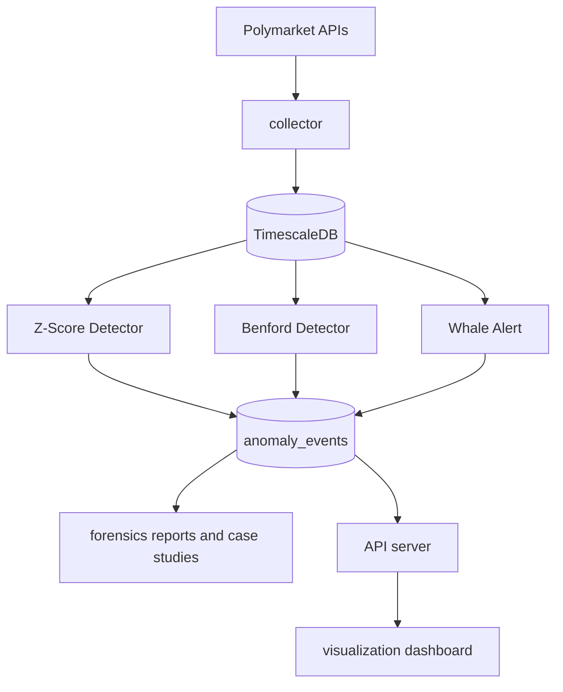

# PolyWatch Architecture and Threat Model

This document defines the architecture baseline, threat model, and requirement-to-code traceability for PolyWatch.

## System Architecture (Current)

Core modules:

- Data ingestion and storage: `data_pipeline/`
  - `data_pipeline/collector/main.py`
  - `data_pipeline/collector/fetcher.py`
  - `data_pipeline/collector/db.py`
  - `data_pipeline/db/init.sql`
- Detection and orchestration: `core_analysis/`
  - `core_analysis/zscore_detector.py`
  - `core_analysis/benford_detector.py`
  - `core_analysis/whale_alert.py`
  - `core_analysis/backtester.py`
  - `core_analysis/run_analysis.py`
  - `core_analysis/db_interface.py`
- Forensics and reporting: `forensics/`
- Dashboard/API integration: `visualization/`, `core_analysis/api_server.py`

## Threat Model

| ID | Threat | Description | Detection Signal |
|---|---|---|---|
| T-01 | Spoofing / Layering | Large visible intent with rapid cancellations and low execution | Order lifecycle metrics (future extension) |
| T-02 | Wash-like market manipulation | Coordinated trading that distorts price/volume reality | `zscore_spike`, `whale_trade` |
| T-03 | Sybil-style coordination | Multi-wallet coordinated timing/funding behavior | Forensic case workflow and wallet graph analysis |
| T-04 | Copy-trading leakage | Followers react to target wallet behavior with short lag | Time-correlation analysis (forensics/manual workflow) |
| T-05 | Statistical fabrication | Non-natural digit distributions in generated activity | `benford_violation` |

## Detection Contract (Event Types)

Implemented event outputs written into `anomaly_events`:

- `zscore_spike` from `core_analysis/zscore_detector.py`
- `whale_trade` from `core_analysis/whale_alert.py`
- `whale_directional_bias` from `core_analysis/whale_alert.py`
- `benford_violation` from `core_analysis/benford_detector.py`

## Spec-Driven Artifacts

- `docs/specs/wash_trading.feature`
- `docs/specs/benford_law.feature`

These files define detection behavior as executable-style requirements and are used as validation references.

## Validation Coverage

Main regression and behavior checks:

- `tests/core_analysis/test_zscore_detector.py`
- `tests/core_analysis/test_whale_alert.py`
- `tests/core_analysis/test_benford_detector.py`
- `tests/core_analysis/test_backtester.py`
- `tests/core_analysis/test_e2e.py`

## Scope Boundaries

- PolyWatch currently provides market-data-level anomaly detection plus forensic triage tooling.
- Full on-chain entity attribution is out of current automation scope and requires dedicated chain-log parsing plus wallet-linking pipelines.
