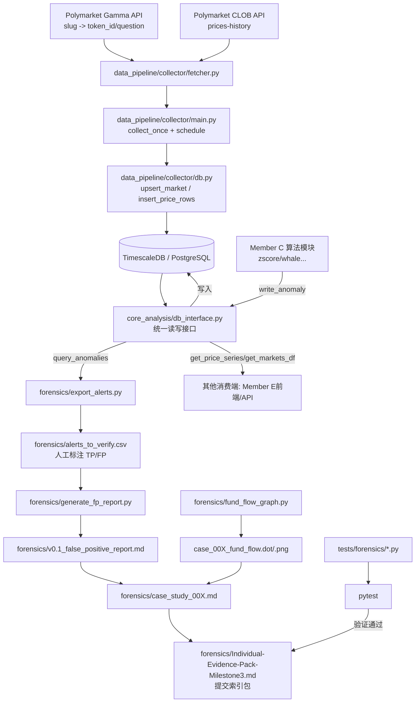

# PolyWatch 系统运行逻辑（全成员视角）

本文档保存了当前项目的系统运行逻辑文字说明与逻辑图，便于复现、答辩与提交说明。

---

## 零、全项目目录说明（从项目整体角度）

> 说明：以下“成员归属”基于仓库内现有说明文档（如 `AGENTS.md`、各模块 README、spec/plan）做归纳。

### 0.1 顶层目录与作用

| 目录 | 主要内容 | 作用 | 主要归属 |
|---|---|---|---|
| `data_pipeline/` | Docker Compose、collector、DB schema、数据管道 README | 从 Polymarket API 持续拉取价格数据并写入 TimescaleDB，是全系统数据入口 | **共享基础设施**（全组共用） |
| `core_analysis/` | `db_interface.py`、`zscore_detector.py`、`whale_alert.py`、`data_quality.py` | 算法与共享 DB 访问层；对外提供读写异常与价格序列的统一接口 | **Member C 主导 + 共享接口** |
| `forensics/` | 导出告警、FP 报告、资金流图、case study、evidence pack | Member D 的取证工作区，完成 M2/M3 交付核心产物 | **Member D 主导** |
| `visualization/` | `polywatch-frontend`（Next.js/TS）、可视化设计文档 | 前端展示与交互层，消费后端/DB产出数据做可视化 | **Member E 主导（前端）** |
| `specs/` | milestone 规格、验收标准、计划跳转说明 | 定义“做什么 + 如何验收”，是需求约束来源 | **共享规范层** |
| `docs/plans/` | 执行计划、任务清单、复现手册、运行逻辑文档 | 定义“怎么做 + 当前进度 + 如何复现” | **共享执行层（当前由 Member D 维护较多）** |
| `tests/` | `data_pipeline/`、`core_analysis/`、`forensics/` 测试 | 自动化验证各模块行为，防回归 | **共享质量层** |
| `data_ingestion/` | 早期抓取脚本与说明 | 历史/辅助抓取模块（当前主线已以 `data_pipeline` 为主） | **共享（历史/辅助）** |
| `.specify/`、`.opencode/`、`.ruff_cache/` | 模板、工具缓存、工作流元数据 | 开发辅助，不属于业务运行主链路 | **工程辅助层** |

### 0.2 你最常用的目录（Member D 视角）

1. `forensics/`：你输出报告和案例的主目录（M2/M3 最终产物都在这里）。
2. `tests/forensics/`：你负责功能的回归测试目录。
3. `core_analysis/db_interface.py`：你读取告警和市场数据的统一入口。
4. `docs/plans/`：你维护的执行计划、任务清单、复现文档。

### 0.3 跨目录协作关系（简化）

`data_pipeline` 负责“把数据放进库”  
→ `core_analysis` 负责“算法 + 统一接口”  
→ `forensics` 负责“核验、分析、报告产出”  
→ `visualization` 负责“前端展示与交互”  
→ `tests` 负责“全链路质量保障”。

---

## 一、按成员视角的运行逻辑

### 1.1 Member C（核心算法 / 异常检测）

**主要目录**：`core_analysis/`  
**核心输入**：`data_pipeline` 写入的 `price_history` 与 `markets`  ️
**核心输出**：`anomaly_events`（供 D/E 消费）

典型运行路径：

1. 用 `core_analysis/db_interface.py` 的 `get_price_series(slug)` 读取市场价格序列。
2. 运行检测算法模块（如 `zscore_detector.py`、`whale_alert.py`）计算异常点。
3. 调用 `write_anomaly(...)` 把异常写入数据库 `anomaly_events`。
4. 通过 `query_anomalies(...)` 自检写入结果是否符合预期。

#### 当前建议模式：手动检测并写库（非自动调度）

> 说明：当前仓库具备检测算法模块，但未统一编排为“持续自动检测任务”。因此建议按如下手动流程执行。

**前置条件**

1. `data_pipeline` 容器正常运行并持续写入 `price_history`。
2. 本地 Python 环境可连接数据库（`DATABASE_URL` 可用）。
3. 已安装根依赖：

```bash
python -m pip install -r requirements.txt
```

**步骤 A：读取市场价格并执行 Z-Score 检测**

```bash
python - <<'PY'
from datetime import datetime, timezone

from core_analysis.db_interface import get_price_series, get_token_id_by_slug, write_anomaly
from core_analysis.zscore_detector import ZScoreDetector

slug = "what-will-happen-before-gta-vi"
series_df = get_price_series(slug)

if series_df.empty:
    print(f"[skip] no price data for {slug}")
    raise SystemExit(0)

price_series = series_df["price"]
detector = ZScoreDetector(window=30, threshold=2.5)
result = detector.detect(price_series)

token_id = get_token_id_by_slug(slug)
if token_id is None:
    print(f"[skip] token_id not found for {slug}")
    raise SystemExit(0)

count = 0
for ts, row in result[result["is_anomaly"]].iterrows():
    write_anomaly(
        token_id=token_id,
        detected_at=ts.to_pydatetime() if hasattr(ts, "to_pydatetime") else datetime.now(timezone.utc),
        event_type="zscore_spike",
        severity="high" if abs(float(row["z_score"])) >= 4 else "medium",
        detail={
            "z_score": float(row["z_score"]),
            "price": float(row["price"]),
            "market_slug": slug,
        },
    )
    count += 1

print(f"[done] wrote {count} zscore anomalies for {slug}")
PY
```

**步骤 B：按交易量阈值执行 Whale 检测（如有 trade_size 数据）**

> 当前仓库内 `WhaleAlert` 依赖输入表包含 `trade_size` 列。若你的输入数据尚未构造该列，可先跳过此步骤，或在离线交易数据上运行后再写库。

示例（离线 DataFrame 运行）：

```python
from core_analysis.whale_alert import WhaleAlert

alert = WhaleAlert(size_threshold=200)
whales_df = alert.detect(trades_df)  # trades_df 需包含 trade_size
```

**步骤 C：验证是否写库成功**

```bash
python - <<'PY'
from core_analysis.db_interface import query_anomalies

slug = "what-will-happen-before-gta-vi"
df = query_anomalies(slug=slug)
print(df.tail(10))
print(f"total anomalies for {slug}: {len(df)}")
PY
```

**步骤 D：交给 Member D 流程继续取证**

1. `forensics/export_alerts.py` 导出待核验告警；
2. 人工标注 TP/FP；
3. `forensics/generate_fp_report.py` 生成误报报告；
4. case study + fund-flow 图 + Evidence Pack 整理。

### 1.2 Member D（取证 / 报告交付）

**主要目录**：`forensics/`、`tests/forensics/`、`docs/plans/`  
**核心输入**：`anomaly_events` + 外部事件时间线 + 钱包流向证据  
**核心输出**：FP 报告、资金流图、case study、Evidence Pack

典型运行路径：

1. `forensics/export_alerts.py`：从 `query_anomalies(...)` 导出 `alerts_to_verify.csv`。
2. 人工补充 TP/FP 标签后，`forensics/generate_fp_report.py` 生成 `v0.1_false_positive_report.md`。
3. `forensics/fund_flow_graph.py` 生成 `.dot/.png` 资金流图（缺 graphviz 可执行时降级为 `.dot`）。
4. 产出 `case_study_00X.md` + `Individual-Evidence-Pack-Milestone3.md`。
5. 用 `tests/forensics/` 回归验证三类核心能力（导出、统计、可视化）。

#### 人工标注逐条判定流程（`is_true_positive` / `verification_notes`）

> 目标：让不同人按同一标准做 TP/FP 标注，减少主观漂移。

**A. 字段填写规则**

- `is_true_positive`：
  - 填 `true`：更像“操纵/可疑资金行为”
  - 填 `false`：更像“新闻驱动或正常市场重定价”
  - 拿不准可暂时留空（后续复审）
- `verification_notes`：必须写“为何如此判断”的证据摘要（事件窗口、链上结构、冲突点）。

**B. 逐条判定顺序（建议严格按顺序）**

1. **先看公共事件时间窗（±12h）**
   - 如果 `detectedAt` 附近存在强公共事件（辩论、刺杀事件、选举夜关键州 call 等），优先考虑 `false`。
2. **再看资金流结构证据**
   - 若观察到同源资金分发、多钱包同步、短链路中继后集中入场等模式，倾向 `true`。
3. **再看统计强度（z-score / severity）**
   - `|z| >= 5` 且无强公共事件支撑：偏 `true`
   - `2.5 <= |z| < 4`：单靠统计不足，需人工结合上下文
   - `severity=high` 仅表示统计显著，不等于一定操纵
4. **冲突处理规则**
   - 公共事件证据强 + 资金流证据弱 → 倾向 `false`
   - 公共事件证据弱 + 资金流证据强 → 倾向 `true`
   - 两边都强或都弱 → 先留空，并在 notes 写明“冲突待补证”

**C. `verification_notes` 可复用模板**

- 判 `false`：
  - `Matched major public event within ±12h of detectedAt; repricing appears consistent with public information shock, no strong coordinated fund-flow evidence observed.`
- 判 `true`：
  - `No strong public-event catalyst near detectedAt; observed concentrated/relay-style fund flow and synchronized wallet behavior, likely manipulation candidate.`
- 暂不判定：
  - `Mixed evidence: statistical spike exists but causality unclear. Requires additional on-chain attribution and timestamp alignment before TP/FP decision.`

**D. 执行优先级建议**

1. 先核验已预标注的高置信度样本（`true/false`）
2. 再核验 `severity=high` 且 `|z|>=4` 的样本
3. 最后批量处理中等波动样本（多为 `false` 或待定）

### 1.3 Member E（前端可视化 / Dashboard）

**主要目录**：`visualization/polywatch-frontend/`  
**核心输入**：市场概览、价格序列、异常事件（来自 DB 接口/API）  
**核心输出**：可交互的监控页面（sidebar、price chart、anomaly feed）

典型运行路径：

1. 前端页面组件消费后端封装的数据接口（`get_markets_df` / `get_price_series` / `query_anomalies` 对应数据结构）。
2. 在 Dashboard 展示市场状态、价格曲线与异常事件流。
3. 与 C/D 的输出形成闭环：C 产异常、D 做取证、E 做可视化呈现。

### 1.4 共享基础层（全成员）

1. `data_pipeline/` 负责每 5 分钟采集并写库（TimescaleDB）。
2. `core_analysis/db_interface.py` 是跨成员共享接口。
3. `tests/` 为跨模块质量保障层。

---

## 二、运行逻辑（文字版）

当前项目可按“**数据采集 → 数据存储 → 分析/取证 → 报告产出**”理解：

1. **数据采集层（`data_pipeline/collector`）**
   - `main.py` 定时执行（默认每 300 秒）`collect_once()`。
   - 每个市场 slug 先用 `fetcher.resolve_token_id()` 从 Gamma API 解析 token_id。
   - 再用 `fetcher.fetch_price_history()` 从 CLOB API 拉取价格历史（按 6 天分块，规避 API 时间跨度限制）。
   - 通过 `db.py` 写入 TimescaleDB：
     - `upsert_market()` 维护 `markets`
     - `insert_price_rows()` 写 `price_history`（`ON CONFLICT DO NOTHING` 保证幂等）
     - `get_latest_timestamp()` 实现增量抓取

2. **共享数据库接口层（`core_analysis/db_interface.py`）**
   - 为 C/D/E 成员提供统一读写入口：
     - `get_price_series()`、`get_markets_df()`、`get_active_slugs()`
     - `write_anomaly()`（成员 C 算法写异常）
     - `query_anomalies(slug, severity)`（成员 D 取证读取异常）

3. **Member D 取证流水线（`forensics/`）**
   - `export_alerts.py`：`export_anomalies_to_csv()` 导出异常到 `alerts_to_verify.csv`，并添加人工标注列。
   - `generate_fp_report.py`：`generate_report()` 基于标注结果计算 TP/FP/FP rate，输出 `v0.1_false_positive_report.md`。
   - `fund_flow_graph.py`：`create_wallet_graph()` 生成资金流 `.dot`，可用时渲染 `.png`；若 graphviz 可执行缺失则优雅降级（至少保留 `.dot`）。

4. **测试与交付层**
   - 关键自动化测试位于 `tests/forensics/`：
     - `test_export_alerts.py`
     - `test_generate_fp_report.py`
     - `test_fund_flow_graph.py`
   - 通过测试后，产出 case study 与 Evidence Pack（索引式提交稿）作为 Milestone 3 最终交付。

---

## 三、系统运行逻辑图（Mermaid）



---

## 四、建议的最小运行顺序（可选）

1. 启动并确认 data pipeline 正常写库（collector + TimescaleDB）。
2. 运行算法模块写入 `anomaly_events`（成员 C 流程）。
3. 运行 `export_anomalies_to_csv()` 生成待核验 CSV。
4. 完成人工标注后运行 `generate_report()` 生成 FP 报告。
5. 运行 `create_wallet_graph()` 生成 case 资金流图并完成 case study。
6. 回归测试：

```bash
python -m pytest tests/forensics/test_export_alerts.py tests/forensics/test_generate_fp_report.py tests/forensics/test_fund_flow_graph.py -v
```

---

## 五、成员协作接口清单（速查）

| 提供方 | 接口/产物 | 消费方 | 用途 |
|---|---|---|---|
| data_pipeline | `markets` / `price_history` 表 | C / D / E | 全系统基础数据 |
| Member C | `anomaly_events`（通过 `write_anomaly` 写入） | D / E | 取证与可视化异常输入 |
| Member D | `v0.1_false_positive_report.md`、`case_study_00X.md`、fund-flow 图 | E / 教师评审 | 解释异常是否为操纵 |
| Member E | Dashboard 页面与可视化组件 | 全组/演示 | 统一展示系统状态与异常信号 |
| 全组 | `docs/plans/tasks.md` / `specs/*` | 全组 | 统一任务、验收与追踪 |

> 推荐协作节奏：先保证 `data_pipeline` 持续写库，再跑 C 的检测写异常，随后 D 做取证与报告，最后由 E 集成展示与演示。
