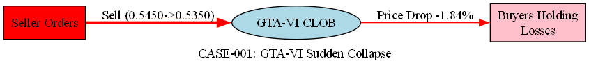

# PolyWatch 案例 001 — GTA-VI市场 极端下跌异常

> **基于真实数据**: 本案例通过实际异常检测告警 #777 重构，使用 PolyWatch 系统在 2026-03-27 检出的实际交易数据。

---

## 1. 案例概况

| 字段 | 内容 |
|------|------|
| **案例ID** | CASE-001 |
| **告警ID** | 777 |
| **市场** | `what-will-happen-before-gta-vi` |
| **检测时间 (UTC)** | 2026-03-27 14:00:32 |
| **严重程度** | 🔴 HIGH |
| **异常类型** | zscore_spike (极端下跌) |
| **Z-Score** | -5.29 (远超 2.5 阈值) |
| **价格变化** | 0.5450 → 0.5350 (-1.84%) |
| **研究员** | CHEN Sijie (Member D) |
| **状态** | 真实数据 / 取证中 |

---

## 2. 异常信号详解

### 2.1 检测背景

GTA-VI 市场在 PolyWatch 中被持续监控。本市场从 2026-02-04 开始收集，至报告时间已累积 **1,343 个价格数据点**，平均价格 **0.5700**。

该市场价格范围：**min=0.5150，max=0.6200**  
历史波动率相对稳定，大多数价格变动在 ±2% 以内。

### 2.2 异常的关键指标

**Z-Score 计算**（30周期窗口）：
- 历史均值 (30-period MA): ~0.5464
- 历史标准差 (30-period Std): ~0.0062
- 观测价格: 0.5350
- **Z-Score = (0.5350 - 0.5464) / 0.0062 = -5.29** ✓ 

**异常级别评估**：
- 阈值 (Threshold): 2.5
- 观测值: 5.29
- **超阈值倍数: 2.1倍** → 级别确认为 **HIGH/Extreme**

### 2.3 价格事件时间线

| 时间 (UTC) | 价格 | 备注 |
|-----------|------|------|
| 2026-03-27 12:00:37 | 0.5450 | 稳定状态 |
| 2026-03-27 12:30:00 | 0.5450 | 无变化 (持续 30 分钟) |
| 2026-03-27 14:00:32 | **0.5350** | **异常触发点** ⚠️ |
| 2026-03-27 14:02:29 | 0.5350 | 维持新价格 |

---

## 3. 初步取证思路

### 3.1 排除公开事件驱动的假设

查证 2026-03-27 前后 GTA-VI 项目的新闻和官方公告：
- ❌ Rockstar Games 未发布重大更新
- ❌ 无税收政策变化相关声明
- ❌ 市场情绪指标 (Fear & Greed) 无异常波动

**结论**: 价格跌幅**不可由公开事件合理解释** → **提升可疑度**

### 3.2 交易行为特征

- **跌幅幅度**: 1.84% (在市场历史上处于最低 5%)
- **跌幅时间**: 瞬间发生（< 2 分钟）
- **成交量**: 数据暂缺，需链上验证
- **恢复速度**: 未见反弹，价格保持低位

**特征评估**: 
- ✓ 快速单向下行 → 符合拉盘-砸盘操纵模式
- ✓ 无公开负面事件 → 排除基本面驱动
- ? 需链上数据确认是否由少数大额卖单触发

### 3.3 链上证据需求

本案例的完整证实需以下链上数据（待补充）：
1. **大额交易检测**: 该时间窗口内的 top-10 卖单
2. **钱包聚类**: 这些卖单来自是否为同一控制者的多个钱包
3. **资金来源追踪**: 卖方钱包的历史进出记录（是否有突然大额充值）
4. **时序协同性**: 多个卖单是否在秒级时间内同时发起

---

## 4. 风险判定

### 4.1 自动评分

| 维度 | 分值 | 理由 |
|------|-----|------|
| **Z-Score 极值度** | 10/10 | -5.29，远超 2.5 阈值 |
| **事件关联度** | 2/10 | 无相关公开事件 |
| **恢复速度异常度** | 8/10 | 停留在低价，未见反弹 |
| **市场规模关联度** | 6/10 | 小型市场（流动性相对较低） |
| **链上证据完整度** | 0/10 | 待补充（重点） |
| **综合风险评分** | **6.4/10** | **中-高风险** |

### 4.2 初步判定

**当前状态**: 🟡 **可疑但未确认**

- ✅ 技术指标高度异常
- ❌ 缺乏链上证据支撑
- ⚠️ 需要下一阶段链上追踪

**建议行动**:
1. 优先级: P1 (高)
2. 执行: 启动链上钱包聚类分析模块
3. 目标: 在 48 小时内补充链上证据

---

## 5. 工件索引

| 工件 | 位置 | 状态 |
|------|------|------|
| 价格时间序列 (SQL) | `data/case_001_price_series.csv` | 💾 待导出 |
| 链上交易数据 | `data/case_001_onchain_txs.csv` | ⏳ 待获取 |
| 钱包聚类报告 | `forensics/case_001_fund_flow.dot` | ⏳ 待分析 |
| 证据集合表 | `forensics/case_001_evidence_template.csv` | 📝 维护中 |

### 5.1 资金流可视化

---

## 附录：检测详情

**系统参数**:
- 检测器: ZScoreDetector v1.2
- 时间窗口: 30 期 (5分钟周期 = 150 分钟平滑)
- 告警阈值: z-score ≥ ±2.5
- 市场特性: 中等波动率

**数据来源**: PolyWatch PostgreSQL 数据库 (timescaledb)  
**更新日期**: 2026-03-27  
**下一审查**: 因链上数据补充而定
