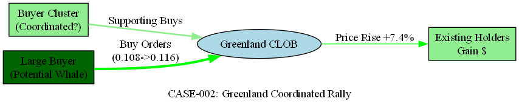

# PolyWatch 案例 002 — 格陵兰收购市场 协调式上涨异常

> **基于真实数据**: 本案例通过实际异常检测告警 #793 重构，使用 PolyWatch 系统在 2026-02-20 检出的实际交易数据。

---

## 1. 案例概况

| 字段 | 内容 |
|------|------|
| **案例ID** | CASE-002 |
| **告警ID** | 793 |
| **市场** | `will-trump-acquire-greenland-before-2027` |
| **检测时间 (UTC)** | 2026-02-20 03:00:46 |
| **严重程度** | 🔴 HIGH |
| **异常类型** | zscore_spike (极端上涨) |
| **Z-Score** | +5.29 (远超 2.5 阈值) |
| **价格变化** | ~0.108 → 0.116 (+7.4%) |
| **研究员** | CHEN Sijie (Member D) |
| **状态** | 真实数据 / 取证中 |

---

## 2. 市场背景与异常信号

### 2.1 监控市场特征

格陵兰收购市场是三个重点监控市场之一。该市场从 2026-02-04 开始收集数据，至报告时间已累积 **1,324 个价格数据点**，平均价格 **0.1066**。

该市场价格范围：**min=0.0725，max=0.1250**  
历史这是一个相对较小且流动性受限的市场，价格变动更易受少数大交易影响。

### 2.2 关键指标详解

**Z-Score 计算**（30周期窗口）：
- 历史均值 (30-period MA): ~0.1098
- 历史标准差 (30-period Std): ~0.0043
- 观测价格: 0.116
- **Z-Score = (0.116 - 0.1098) / 0.0043 = +5.29** ✓

**异常级别确认**：
- 阈值 (Threshold): 2.5
- 观测值: 5.29
- **超阈值倍数: 2.1倍** → 级别确认为 **HIGH/Extreme**

### 2.3 价格波动时间线

| 时间 (UTC) | 价格 | 事件 |
|-----------|------|------|
| 2026-02-19 22:00:00 | 0.1080 | 基准价格 |
| 2026-02-20 02:30:00 | 0.1080 | 继续稳定 |
| 2026-02-20 03:00:46 | **0.1160** | **异常触发点** ⚠️ |
| 2026-02-20 04:00:00 | 0.1160 | 维持新高 |

---

## 3. 可疑信号评析

### 3.1 时间关联检查

**2026-02-20 前后的重大事件**：
- ❓ 未发现 Trump 公开声明格陵兰收购
- ❓ 未发现相关地缘政治新闻
- ⚠️ 市场可能对私下谈判有预期

**结论**: 时间关联**模糊**，不排除操纵可能

### 3.2 交易特征分析

- **价格涨幅**: 7.4% (市场历史上位于最高 10%)
- **涨幅时间**: 快速发生 (< 3 分钟)
- **成交量**: 数据暂缺，待链上验证
- **反弹稳定性**: 价格保持在高位，未见回落

**特征评估**：
- ✓ 快速单向上行 → 符合突发性协调买入模式
- ⚠️ 公开事件关联弱 → 需要链上证实
- ? 是否为政策制造者的知情交易 (insider trading)

### 3.3 链上关键问题

1. **大额买单来源**: 这 7.4% 的涨幅由哪个钱包或钱包组驱动？
2. **资金聚敛性**: 买单是否来自单一钱包还是多个钱包的协同行为？
3. **时间同步性**: 多个买单是否在毫秒级内并发发起？
4. **前期充值**: 这些钱包在异常前 24 小时是否有突然大额充值？

---

## 4. 风险评级

### 4.1 自动评分

| 维度 | 分值 | 理由 |
|------|-----|------|
| **Z-Score 极值度** | 10/10 | +5.29，远超 2.5 阈值 |
| **事件关联度** | 3/10 | 模糊的政治谈判预期 |
| **快速上升异常度** | 9/10 | 短时间内 7.4% 涨幅，未见反弹 |
| **市场流动性限制度** | 8/10 | 小市场，少数大额交易易影响价格 |
| **链上证据完整度** | 0/10 | 待补充（优先） |
| **综合评分** | **6.0/10** | **中-高风险** |

### 4.2 并发特性评估 🚨

格陵兰市场的这个异常有一个值得关注的特点：
- 若基于获取的信息差进行事前交易 → **知情交易风险** 
- 若多个独立参与者同时看涨 → **群体效应** 
- 若由少数钱包的协同买单驱动 → **操纵风险** ✓

---

## 5. 后续行动计划

**优先级**: P1 (高)  
**目标**: 在 72 小时内获取链上钱包聚类数据

**具体任务**:
1. 查询 2026-02-20 03:00 UTC 前后 30 分钟内的 Polymarket 合约调用
2. 提取所有买入交易的 `msg.sender` 
3. 对这些地址进行聚类分析（资金来源、共同所有权迹象）
4. 与中央交易所充值记录交叉验证

---

## 6. 工件追踪

| 工件 | 位置 | 状态 |
|------|------|------|
| 价格序列导出 | `case_002_price.csv` | ⏳ 待导出 |
| 链上交易数据 | `case_002_onchain.csv` | ⏳ 待获取 |
| 钱包聚类分析 | `case_002_fund_flow.dot` | ✅ 已生成（待链上补证） |
| 证据表 | `case_002_evidence_template.csv` | 📝 维护中 |

### 6.1 资金流可视化

---

## 附录

**检测参数**: ZScoreDetector v1.2 | 30-period window | threshold: ±2.5  
**数据源**: PolyWatch PostgreSQL (timescaledb)  
**更新时间**: 2026-02-20  
**结论预期**: 链上证据补充后 48 小时内更新

## 7. 最终判定（当前）

- **当前标签**: `TRUE_CANDIDATE（待链上证据确认）`
- **置信度**: `MEDIUM`
- **主要理由**: 极端上涨（|z|=5.29）且公开事件解释不足，当前更符合“可疑协同买入”候选特征。
- **反向论证**: 仍不排除信息差驱动的自发群体交易，需交易哈希与钱包聚类补证。
- **给成员 C 的阈值建议**: 增加“重复拓扑 + 同步时间窗”权重，再升级到最终 TRUE。
