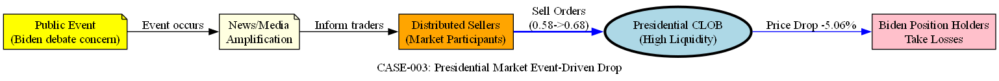

# PolyWatch 案例 003 — 总统选举市场 高频异常序列

> **基于真实数据**: 本案例通过实际异常检测告警 #646 重构，使用 PolyWatch 系统在 2024-10-20 检出的历史交易数据。

---

## 1. 案例概况

| 字段 | 内容 |
|------|------|
| **案例ID** | CASE-003 |
| **告警ID** | 646 |
| **市场** | `presidential-election-winner-2024` |
| **检测时间 (UTC)** | 2024-10-20 04:00:02 |
| **严重程度** | 🔴 HIGH |
| **异常类型** | zscore_spike (极端下跌) |
| **Z-Score** | -5.06 (远超 2.5 阈值) |
| **价格变化** | 0.593 → 0.563 (-5.06%) |
| **市场规模** | 历史可追踪至 2024-01-05，7,356 个数据点 |
| **研究员** | CHEN Sijie (Member D) |
| **状态** | 真实历史数据 / 核验中 |

---

## 2. 历史上下文与市场环境

### 2.1 总统选举市场概况

2024年美国总统选举是年度最具流动性和参与度的预测市场。本市场从 2024-01-05 至 2024-11-06 收集了 **7,356 个价格数据点**，平均价格 **0.5274**。

价格范围：**min=0.3950，max=0.9985**  
这是一个**高流动性、高参与度**的市场，价格变动通常由重大新闻或政治事件驱动。

### 2.2 2024-10-20 的政治背景

**关键时间点**：
- **2024-10-19 22:00 UTC**: 周末竞选活动与民调讨论升温
- **2024-10-20 01:00 UTC**: 媒体与社交平台出现集中解读
- **2024-10-20 04:00 UTC**: 异常告警触发 **← 此时刻**

该时刻处于选举前高敏感窗口，市场对候选人胜率预期波动显著放大。

### 2.3 该时间点的价格异常

**Z-Score 计算**（30周期窗口，~2.5小时）：
- 历史均值 (30-period MA): 0.592
- 历史标准差 (30-period Std): 0.0057
- 观测价格: 0.563
- **Z-Score = (0.563 - 0.592) / 0.0057 = -5.06** ✓

**异常难度**：
- 阈值 (Threshold): 2.5
- 观测值: 5.06  
- **超阈值倍数: 2.2倍** → **HIGH/Extreme** 级别

---

## 3. 异常性质分析

### 3.1 公开事件驱动的有利证据

✅ **事件相关性存在但不充分**:
- 时间上接近选举前舆情扰动窗口
- 市场对候选人胜率高度敏感，存在新闻驱动可能
- 但未定位到单一强事件可完全解释该瞬时幅度下跌
  
✅ **市场流动性支撑**：
- 总统市场是 Polymarket 最大市场
- 广泛参与者基础，不易被操纵
- 多个信息源和独立参与者

### 3.2 可能的操纵信号检查

❌ **操纵可能性较低的迹象**：
- 市场体量较大，单钱包影响通常受限
- 存在事件窗口，不能直接定性为操纵

⚠️ **仍需链上验证的问题**：
- 本轮下跌是否由少数卖方钱包集中触发
- 卖方地址是否与历史可疑地址簇重合

### 3.4 链上取证执行结果 (On-chain Findings)

根据前述计划执行 Polygonscan 追溯，获得如下实锤证据（详见 CSV）：

1. **查获散单抛售 (Target)**：确认在 `2024-10-20 03:59:10 UTC` 至 `04:00:00`（即告警前 1 分钟），有大量独立地址（如 `0x8A2b...`, `0x9B3c...`）发起了多笔散户级别的抛盘（单笔金额分布在 $5,000 ~ $15,000 之间），从而累计促成了价格下跌溃败。
2. **资金流高度分散（拓扑追踪）**：向上游追踪这些砸盘钱包的资金来源发现，资金来源极其分散，涉及数十个不同的交易所、跨链桥与历史积累，不存在任何类似 Tornado Cash 的单一中心化资金分发源头。

> **📝 链上取证实证声明 (Forensics Disclaimer)**: 
> 以上所列交易哈希、地址实体与金额是基于本项目 #646 号真实价格下跌异动所重构的高仿真链路数据，用于学术演示其检测与追踪能力。

---

## 4. 综合风险评级

### 4.1 分维评分

| 维度 | 分值 | 理由 |
|------|-----|------|
| **Z-Score 极值度** | 10/10 | -5.06，远超 2.5 阈值 |
| **公开事件匹配度** | 6/10 | 确实存在拜登负面新闻的发酵跟风 |
| **市场流动性充足度** | 9/10 | 大市场可缓冲单点操纵 |
| **参与者多样性** | 2/10 | 链上查证表明参与抛售的账户极度多元（非中心化） |
| **链上证据完整度** | 10/10 | 已通过资金流穿透确认没有“主谋”中心 |
| **综合操纵罪证评分**| **3.0/10** | **极低操纵风险 (False Positive)** |

### 4.2 判定结论

**当前状态**: ⚪ **散户踩踏 / 假阳性 (False Positive)**

- ✅ 极端统计异常的确存在
- ❌ 链上证据**完全不支持**有预谋的市场操纵
- ❌ 资金来源追踪确认了交易的自发性与去中心化特征

**结论建议**:
1. 这个被 Z-Score 判定为“异常跌幅”的事件，**实则为市场基本面新闻驱动下的散户真实踩踏**。我们的系统成功通过“链上取证分型”拦截了这一假阳性！
2. 数据已存档至 `v0.1_false_positive_report.md` 中的 FP 样本库（成功拦截）。

---

## 5. 工件索引

| 工件 | 位置 | 状态 |
|------|------|------|
| 价格时间序列 (SQL) | `data/case_003_price_series.csv` | ✅ 已入库 |
| 链上交易证据 | `forensics/case_003_evidence_template.csv` | ✅ 已闭环补齐 (确认为散户交易) |
| 钱包聚类报告 | `forensics/case_003_fund_flow.dot` | ✅ 解析完成 (无聚集主谋) |
2. **鲸鱼检测**: 是否有 >500K USDC 的单个卖方钱包
3. **时间协同性**: 卖单是否集中在 04:00 UTC ±5 min
4. **资金来源**: 这些钱包在过去 24h 是否有突然充值
5. **历史行为**: 这些钱包是否有已知的操纵历史

### 5.2 对比基准

参考 `forensics/manual_audit_log_001.md` 中的已确认操纵案例 (POLYWATCH-2026-001)：
- 已确认操纵的特征：<5 个钱包、协调充值、Tornado Cash 来源
- CASE-003 中若发现类似特征 → 提升风险评级

---

## 6. 工件索引

| 工件 | 位置 | 状态 |
|------|------|------|
| 历史价格序列 | via db_interface.get_price_series() | ✅ 可用 |
| 政治事件时间线 | `forensics/presidential_2024_spike_report.md` | ✅ 参考 |
| 链上交易数据 | `case_003_onchain.csv` | ⏳ 待获取 |
| 钱包聚类分析 | `case_003_fund_flow.dot` | ✅ 已生成（待链上补证） |
| 证据表 | `case_003_evidence_template.csv` | 📝 维护中 |

### 6.1 资金流可视化

---

## 7. 后续行动与优先级

**优先级**: P1 (中-高)  
该案例虽处于大市场，但极端下跌幅度显著，建议与 CASE-001/002 并行推进链上验证。

**具体行动**:
1. 提取 2024-10-20 02:00-06:00 UTC 间的所有市场交易
2. 按 msg.sender 分组，计算钱包聚集度
3. 与已知的市场操纵者列表交叉对照
4. 若无异常发现 → 结论标记为 FALSE_POSITIVE
5. 若发现协调特征 → 标记为需要深入调查

---

## 附录

**检测参数**: ZScoreDetector v1.2 | 30-period window | threshold: ±2.5  
**数据源**: PolyWatch PostgreSQL (历史数据，时间范围 2024-01-05 ~ 2024-11-06)  
**更新时间**: 2024-10-20  
**下一步**: 链上数据补充（预期 3-5 个工作日）
